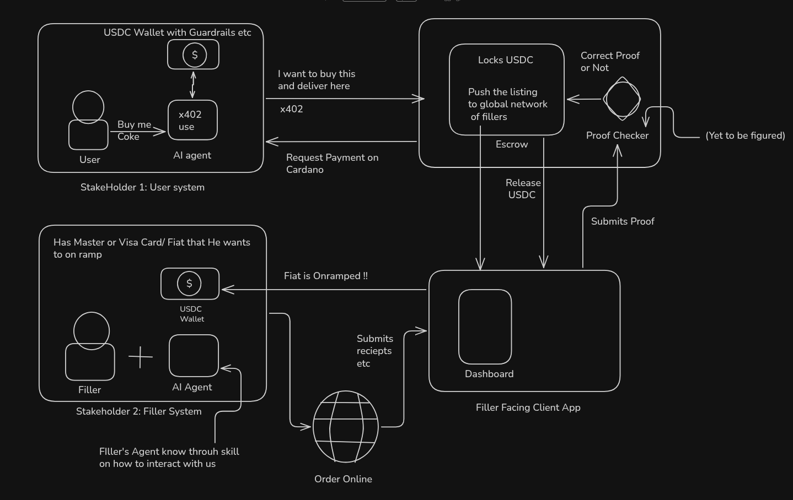

<!-- Banner goes here -->

# eX-402

x402 works well when the thing your agent wants to pay for already accepts crypto. Most of the world doesn't. You can't pay Amazon.in, your local pharmacy or a train booking site with a stablecoin, so an AI agent hits a wall the moment a task needs a real-world purchase.

eX-402 is a way around that wall. It's a global order book where your AI agent posts what it needs bought, and a person on the other side (a **filler**) buys it with their own card and gets paid in stablecoins from escrow. The agent gets the item without anyone handing it a credit card. The filler gets an easy fiat-to-crypto on-ramp and earns a margin on every order.

Two pieces make this trustworthy:

- **Masumi escrow** on Cardano holds the buyer's payment until the job is proven done.
- **Chainlink CRE** checks the proof. The filler uploads the merchant's order-confirmation email, and a CRE workflow verifies its DKIM signature and that it matches the order (item, price, delivery address, timing). It runs as a confidential workflow, so the buyer's address never leaves the enclave.

## How it works

1. **You ask your agent.** "Order me a USB-C cable from Amazon.in." Your Claude agent checks its spending policy and posts the order to the book.
2. **A filler picks it up.** Fillers browse open orders on the dashboard, filter by the rate they're happy with (₹ per tUSDM), and claim the one that fits.
3. **Your agent funds the escrow.** Once claimed, the agent locks the payout in Masumi escrow using your wallet. The filler only sees your delivery address after the money is locked.
4. **The filler buys it.** They check out on Amazon.in with their own card and ship it to you. The delivery name starts with a short order code, which ties this purchase to this order.
5. **The proof is checked.** The filler uploads Amazon's confirmation email. CRE verifies it's genuinely from Amazon and matches the order, in 12 checks.
6. **Everyone settles.** If the proof passes, the escrow pays the filler after a short dispute window. If it fails or never arrives, the buyer gets refunded.

## Architecture



| Part | Where | What it does |
|---|---|---|
| Order book API | `apps/api` | Orders, claims, proof uploads and a shared control view for each order (Fastify + Postgres) |
| Worker | `apps/worker` | Creates escrow terms, watches the chain, triggers CRE, submits results to escrow |
| Filler dashboard | `apps/web` | Live order book, rate filter, claim, ship-to details, proof upload, verification and payout timeline |
| Buyer agent | `examples/buyer-agent` | An MCP server for Claude Code, plus the `order-for-me` skill |
| CRE workflow | `workflows/cre-verify` | Confidential workflow that verifies the order email |
| Verifier | `packages/verification` | Dependency-free DKIM and order checks, shared by the worker and CRE |
| Escrow adapter | `packages/settlement` | Talks to a Masumi payment node (Cardano Preprod) |

## What's real and what's testnet

This runs end to end today, with a few honest caveats:

- **Real:** the Amazon.in purchase, the filler's ₹ payment, Amazon's signed email, and the DKIM verification.
- **Testnet:** escrow runs on Cardano Preprod with test tUSDM, so the filler is paid in test tokens.
- **Simulated:** the CRE workflow runs in the local CRE simulator. Deploying a confidential workflow to Chainlink's network needs their private beta.
- **Not yet:** wallet login (the dashboard uses dev tokens) and delivery confirmation. We prove the order was placed, not that it arrived.

## Running it locally

You'll need:

- Node 22+ and npm
- PostgreSQL 16 (local binaries are fine)
- Docker, for the Masumi payment node
- [Bun](https://bun.sh) and the [CRE CLI](https://docs.chain.link/cre), logged in with `cre login`
- [Claude Code](https://claude.com/claude-code), for the buyer agent
- A Blockfrost Preprod API key

### 1. Install and configure

```sh
npm install
cp .env.example .env    # fill in DATABASE_URL, dev tokens and CRE_VERIFIER_TOKEN
npm run db:migrate
```

### 2. Start a Masumi node and wire it up

Follow [infra/masumi/README.md](infra/masumi/README.md) to start the node and create its wallets. Then fund them:

- test ADA for both wallets from the [Cardano faucet](https://docs.cardano.org/cardano-testnets/tools/faucet);
- test USDM for the buyer wallet from the [Masumi dispenser](https://dispenser.masumi.network).

Then let the app set itself up against the node:

```sh
npm run masumi:setup    # API keys, filler agent registration, writes the Masumi settings into .env
```

### 3. Set up the CRE workflow

```sh
cd workflows/cre-verify/verify-order && bun install && cd -
```

Set `VERIFIER=CRE` in `.env` so the worker verifies proofs through the CRE workflow instead of locally.

### 4. Run it

```sh
npm run build:web    # build the dashboard
npm run dev          # API + dashboard on http://127.0.0.1:3000
npm run worker       # escrow, chain watching, CRE verification
```

Open http://127.0.0.1:3000, hit **Launch app**, and connect as a filler with `DEV_FILLER_TOKEN` from your `.env`.

### 5. Give your Claude agent a wallet

Copy `examples/buyer-agent/profile.example.json` to `profile.json` and fill in your delivery address and spending limit. Then register the buyer tools and the skill with Claude Code:

```sh
claude mcp add global-order-book-buyer --scope user \
  -e GOB_API=http://127.0.0.1:3000 \
  -e GOB_BUYER_TOKEN=<DEV_BUYER_TOKEN> \
  -e BUYER_PROFILE=$PWD/examples/buyer-agent/profile.json \
  -- $PWD/scripts/buyer-mcp.sh

cp -R examples/buyer-agent/skill/order-for-me ~/.claude/skills/
```

Start a new Claude Code session and just ask: *"order me <exact Amazon.in product title>, ₹<total including delivery>"*. The agent confirms with you, posts the order, funds the escrow when a filler claims it, and keeps you posted until the filler is paid.

### Tests

```sh
npm test         # spins up a throwaway Postgres and runs the suite
npm run typecheck
```

## Recording a demo

[docs/DEMO.md](docs/DEMO.md) has the full shot list, timings and troubleshooting. Timings, counted from when the filler claims:

- **5–12 min:** the escrow lock confirms. Only buy after this.
- **Within 35 min:** upload the email.
- **About 70 min:** the payout lands.

## Further reading

- [Demo runbook](docs/DEMO.md) and [demo script](docs/DEMO-SCRIPT.md)
- [CRE workflow](workflows/cre-verify/verify-order/README.md)
- [Masumi node setup](infra/masumi/README.md)

## Hosting

See [Railway + Vercel deployment](docs/DEPLOYMENT.md) for the service layout, deployment configuration, private settings, and validation steps.
