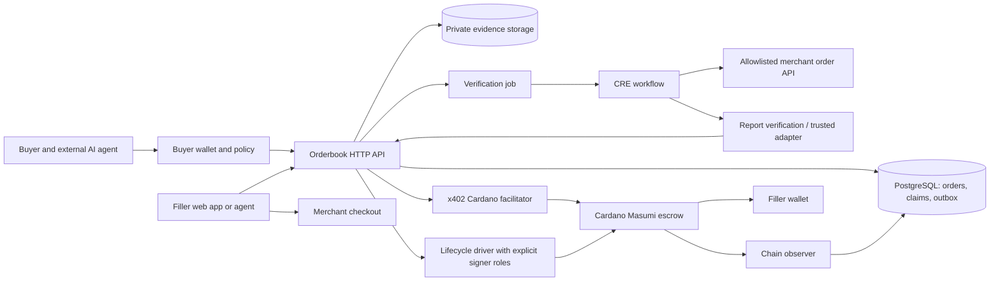
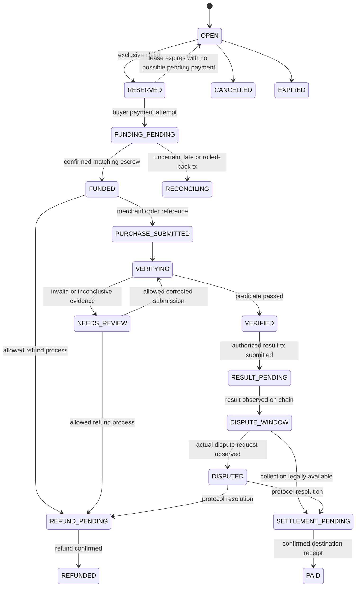

# Architecture

## Boundaries

The original diagram is [preserved here](assets/original-architecture.png). Its central box combines functions that must be distinct in implementation: orderbook state, on-chain escrow, evidence checking, and the authority to submit a settlement transaction.

The following is the user-selected architecture A: match a filler before funding escrow directly to that filler. Platform collection and onward payout are outside the selected money flow.

For native MIP-003 fallback, buyer/seller Masumi Nodes replace the x402-specific funding/lifecycle path. Name the active mode in configuration; a successful test of one mode does not validate the other.

## Components and proposed implementation stack

Use a TypeScript workspace: React/Next.js filler dashboard, a small Fastify API, a separate Node worker, PostgreSQL, S3-compatible private object storage, and a TypeScript CRE workflow compiled with its required supported toolchain. Use one database outbox/job table initially; add a separate queue only if required by measured behavior. The Cardano provider, wallet connector and SDK versions are chosen by G1–G3, not invented in advance. No custom smart contract in the selected MVP architecture.

| Component | Owns | Does not own |
|---|---|---|
| API | Wallet-authenticated requests, quotes, claims, projections | Buyer signing keys or authority to change contract rules |
| Order service | State transitions, optimistic versions, idempotency, private recipient reference | Proof that an on-chain transaction finalized |
| Payment adapter | Scheme-specific terms, payment validation, lifecycle calls and observations | Merchant truth or product-level payout guarantees |
| Merchant adapter | Trusted endpoint configuration and normalized merchant observations | URLs or facts supplied by filler without independent lookup |
| CRE workflow | Deterministic verification predicate over authoritative observations | Arbitrary account access or automatic Cardano spending |
| Result consumer | Authenticate report, bind it to an order, record decision | Treat a locally simulated result as a DON attestation |
| Chain observer | Funding, current escrow state, collection/refund transaction evidence | Blindly trust webhook bodies or HTTP success |
| Buyer monitor | Inspect results, compare evidence, request refund within allowed time | Recover funds unconditionally after the withdrawal window |
| Filler agent runtime | Opportunity selection, fiat budget, authorized checkout, evidence submission and purchase reconciliation | Central card custody, merchant authentication bypass or unconditional claims of best market price |

## Escrow integration modes

**Target: `X402_MASUMI`.** Use the actual Cardano `exact` scheme with `assetTransferMethod: "masumi"`, pinned seller-signed terms and commitment to this order. The x402 exchange buys access to starting the funded procurement job. The successful resource response is an asynchronous acknowledgement; it is not the purchased Coke or final fulfillment.

The resource handler must be safe if invoked before the facilitator finishes settlement: it can persist a pending attempt, but cannot expose delivery details or authorize fiat spend. Funding activation happens only from sufficiently confirmed chain evidence. The server's public x402 endpoint uses protocol headers and requirements generated by the selected SDK, never a homemade JSON payment protocol labeled x402.

The official current SDK explicitly documents incompatibility with the standard Masumi Node's signature expectation. Build or adopt a tested x402-aware lifecycle driver for result/refund/dispute operations, keeping signer roles intact. Time-box feasibility before building UI around it. The core source and caveat are in [research](research/masumi-x402.md).

**Contingent fallback: `MASUMI_NATIVE`.** Use native Masumi job creation, buyer purchase, result submission and settlement. This preserves escrow but is not evidence of x402 procurement funding. Optional separate paid APIs must have a real product use and explicit price; adding a decorative x402 charge does not close the gap. Trigger D7 if the target is infeasible.

**Local mode: `MOCK`.** For UI and deterministic failure tests only. Mock state cannot be used as proof of chain integration.

## Application lifecycle

Application states are projections, not Masumi enum names. Keep `escrow.nativeState` separately with its source and observation time.

The diagram summarizes ordinary paths. G3 must add every actual native expiry/no-result transition to the adapter mapping. `RECONCILING` is an operational hold; retain last known state and resume only after ledger evidence resolves ambiguity. Funding failure can reopen an intent only after all old signed quotes/transactions can no longer fund it; invalidate old claims and verify this before reassigning.

After funding, ordinary claim expiry no longer releases the assignment. A stalled filler requires the native cancellation/refund process. A valid late payment to an expired application reservation is never ignored: quarantine it for reconciliation, block the replacement assignment from spending fiat, and resolve/refund the old escrow. If two distinct funding transactions arrive, treat the excess as an incident/refund obligation, not extra filler proceeds.

## Authority and verification limitation

A seller's ability to submit an arbitrary result hash may exist independently of our application. A filler controlling that seller key could bypass the dashboard. G3 must test this. If the contract does not enforce the merchant predicate, describe the guarantee accurately as **off-chain verification plus buyer monitoring and dispute rights**. CRE approval is then an application policy, not an on-chain condition for withdrawal.

For that model, the buyer agent must watch the chain through the entire dispute window, compare the submitted result with an accepted verification record, and request refund on unauthorized/invalid results. It must reserve enough ADA and time to act. Operator monitoring alone is insufficient if it lacks buyer authorization. Outages near deadlines are a real buyer risk; do not conceal them behind “escrow protected.”

Making CRE approval mandatory at contract level would require a verified supported mechanism or a custom contract. Making the platform hold every filler key changes custody and control; obtain the product decision rather than silently doing so.

## Consistency and recovery

- Use database transactions and a partial unique constraint for the active claim. Two simultaneous claim requests yield one winner and one conflict.
- Persist quotes and x402 settlement deduplication durably. Process-local SDK stores are not adequate for restart-safe money flows.
- Commit state changes and outbox jobs together. Workers may retry; external effects use stable operation IDs and check chain/merchant state before creating another effect.
- Record transaction hash/output reference before waiting for confirmation. HTTP timeout does not mean a payment failed.
- Periodically reconcile every nonterminal escrow from chain state, not only from callbacks. Handle out-of-order observations and rollback detection.
- Keep independent transaction records for funding, result, collection and refund. UI can show a projected state while retaining the exact supporting observations.

## Privacy and deployment

Public order summaries contain product, reward and coarse service region. Only buyer, current funded filler and authorized verifier access recipient data. Encrypt recipient/evidence storage, issue short-lived download links, redact logs, and keep addresses/card information off-chain. A plain hash of a predictable address is not private; use a random high-entropy per-order secret in commitments and keep the preimage private.

Run API/web/worker plus managed or local Postgres for MVP; CRE runs in its supported environment and Cardano operations use a configured provider. Keep merchant credentials, signing keys and CRE secrets in their respective protected runtime stores. Provision buyer/filler keys separately. Use HTTPS for deployed endpoints. Record network, mode, SDK/CLI versions and validator identifiers in an integration manifest.

Run the reference filler agent in a separately authorized runtime. It consumes public opportunities and its private funded assignment through the same API as the dashboard. Its merchant checkout adapter and credentials belong to the filler, while the verifier uses a separate authorized read path where available. This separation prevents the agent's own purchase claim from becoming the sole evidence of success.

Observability must expose correlation ID, order/claim ID, workflow execution ID, terms hash, native escrow ID, transaction hash and reason code, without recipient or payment-card data. Alert on approaching dispute deadlines, verifier outages, unmatched funding and unreconciled payouts.
